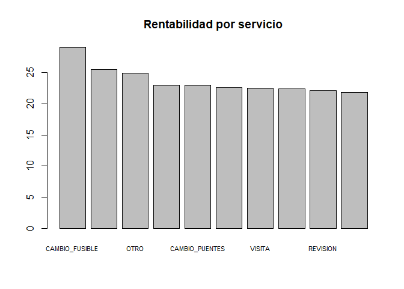
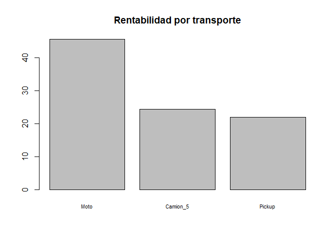
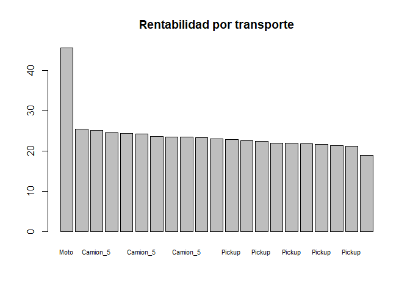
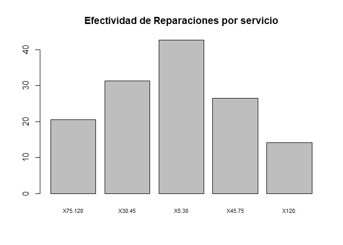

Documentación Lab 7
================
Alexander Palencia 20160391
10/11/2020

# Lab 7 Análisis Inversiones en Energía, S.A

#### El siguiente reporte refleja el estado de la empresa Inversiones en Energía, S.A en el año 2017, el objetivo del siguiente reporte es analisis el exito del año 2017 para aplicarlos en años futuros. Esto se debe a que en el año 2018 existio un decremento del 25% en relación a su utilidad bruta, la meta es lograr aumentar en un 10% su utilidad neta respecto al 2018.

### Limpieza de datos

Se tranformo la data a formato Tidy para que su manipulación e
información fuera más sencilla de utilizar y manipular. En los
comentarios del siguite código se puede contemplar el proceso de
tranformación y limpieza de los datos. Una vez en formato Tidy se
procede a hacer un ánalisis de esta.

``` r
data <- read.csv(file = "D:/Documents/Semestres UFM/2020/Segundo semestre/Data Wrangling/Data-Wrangling-UFM/lab7/c1.csv", header = TRUE)
preuba_data <- read.csv(file = "./c1.csv", header = TRUE)
## Erase null columns
data$X.1 <- NULL
data$X.2 <- NULL
data$X.3 <- NULL
data$X.4 <- NULL
data$X.5 <- NULL
data$X <- NULL

# Data cleaning numeric columns 
numeric_col <- c("Camion_5", "Pickup", "Moto", "factura", "directoCamion_5", "directoPickup", "directoMoto", "fijoCamion_5", "fijoPickup", "fijoMoto")
# dealing with null values
data[numeric_col] <- lapply(data[numeric_col], function(x) ifelse(x == " Q-   ", NA, x))
# elimination of the Q symbol
data[numeric_col] <- lapply(data[numeric_col], function(x) gsub("Q", '', x))
# transforming a number
data[numeric_col] <- lapply(data[numeric_col], function(x) as.numeric(x))

# Data cleaning time columns 
time_col <- c('X5.30', 'X30.45', 'X45.75', 'X75.120', 'X120.')
# dealing with null values
data[time_col] <- lapply(data[time_col], function(x) ifelse(is.empty(x), NA, TRUE))


# Converting data to tidy mode time (duration variable)
time_tidyData <- melt(data = data, id.vars = c("Fecha", "ID", "Camion_5", "Pickup","Moto","Cod","origen", "Lat","Long", "factura","directoCamion_5","directoPickup", "directoMoto", "fijoCamion_5", "fijoPickup", "fijoMoto", "height")) %>% drop_na(value) 
names(time_tidyData)[names(time_tidyData) == 'variable'] <- 'time_duration'
time_tidyData$value <- NULL

# Converting data to tidy mode costs (fixed costs)
fijo_tidyData <- melt(data = time_tidyData, id.vars = c("Fecha", "ID", "Camion_5", "Pickup","Moto","Cod","origen", "Lat","Long", "factura","directoCamion_5","directoPickup", "directoMoto", "height", "time_duration")) %>% drop_na(value) 
names(fijo_tidyData)[names(fijo_tidyData) == 'variable'] <- 'transporte_costo_fijo'
names(fijo_tidyData)[names(fijo_tidyData) == 'value'] <- 'costo_fijo_cantidad'

# Converting data to tidy mode costs (direct costs)
directo_tidyData <- melt(data = fijo_tidyData, id.vars = c("Fecha", "ID", "Camion_5", "Pickup","Moto","Cod","origen", "Lat","Long", "factura", "height", "time_duration", "transporte_costo_fijo", "costo_fijo_cantidad")) %>% drop_na(value) 
names(directo_tidyData)[names(directo_tidyData) == 'variable'] <- 'transporte_costo_directo'
names(directo_tidyData)[names(directo_tidyData) == 'value'] <- 'costo_directo_cantidad'

# Converting data to tidy mode cost total Transport (direct costs + fixed cost)
tidyData <- melt(data = directo_tidyData, id.vars = c("Fecha", "ID", "Cod","origen", "Lat","Long", "factura", "height", "time_duration", "transporte_costo_fijo", "costo_fijo_cantidad", "transporte_costo_directo", "costo_directo_cantidad")) %>% drop_na(value) 
names(tidyData)[names(tidyData) == 'variable'] <- 'transporte_utilizado'
names(tidyData)[names(tidyData) == 'value'] <- 'costo_total'

# Round to 2 decimals numeric columns
data[numeric_col] <- lapply(data[numeric_col], function(x) format(round(x, 2), nsmall = 2))

# Adding costos columns (direct costs + fixed cost)
tidyData$costos <- tidyData$costo_directo_cantidad + tidyData$costo_fijo_cantidad

# validation of total cost is correct
tidyData$resta <- tidyData$costo_total - tidyData$costos
tidyData$resta <- format(round(tidyData$resta, 2), nsmall = 2)
tidyData$resta <- lapply(tidyData$resta, function(x) as.numeric(x))
tidyData$validacion_costos <- ifelse(tidyData$resta == 0.00, TRUE, FALSE)

# Converting to valid date format
tidyData$Fecha <- parse_date_time(tidyData$Fecha,orders="dmy")

# adding profit column
tidyData$ganancias <- tidyData$factura - tidyData$costo_total
```

#### Dataset final formato Tidy

``` r
head(tidyData)
```

    ##        Fecha     ID                      Cod origen      Lat      Long factura
    ## 1 2017-01-16 767918   REVISION_TRANSFORMADOR 150277 14.80836 -89.27484   79.35
    ## 2 2017-06-14 386136                 REVISION 150224 15.54229 -90.17087  101.68
    ## 3 2017-05-03 588199 VERIFICACION_INDICADORES 150224 14.26695 -90.93225  118.86
    ## 4 2017-05-14 658299    VISITA_POR_CORRECCION 150277 14.30663 -89.67311   75.74
    ## 5 2017-09-11 860501    VISITA_POR_CORRECCION 150277 15.43937 -89.21016   81.29
    ## 6 2017-05-17 662960   REVISION_TRANSFORMADOR 150277 14.85318 -89.50079   90.54
    ##   height time_duration transporte_costo_fijo costo_fijo_cantidad
    ## 1     12         X5.30          fijoCamion_5               15.73
    ## 2     12         X5.30          fijoCamion_5               13.87
    ## 3     14         X5.30          fijoCamion_5               20.09
    ## 4      8         X5.30          fijoCamion_5               19.35
    ## 5     10         X5.30          fijoCamion_5               15.28
    ## 6      8         X5.30          fijoCamion_5               13.29
    ##   transporte_costo_directo costo_directo_cantidad transporte_utilizado
    ## 1          directoCamion_5                  24.61             Camion_5
    ## 2          directoCamion_5                  20.81             Camion_5
    ## 3          directoCamion_5                  32.77             Camion_5
    ## 4          directoCamion_5                  34.39             Camion_5
    ## 5          directoCamion_5                  31.01             Camion_5
    ## 6          directoCamion_5                  28.25             Camion_5
    ##   costo_total costos resta validacion_costos ganancias
    ## 1       40.35  40.34  0.01             FALSE        39
    ## 2       34.68  34.68     0              TRUE        67
    ## 3       52.86  52.86     0              TRUE        66
    ## 4       53.74  53.74     0              TRUE        22
    ## 5       46.29  46.29     0              TRUE        35
    ## 6       41.54  41.54     0              TRUE        49

### Datos Importantes antes del análisis

  - Existen 10 distintos servicios en el año 2017.
  - 4 distintas sedes.
  - 4 distintos transportes motos, pickup y camion
  - Se le dieron mantenimiento a 74239 postes distintos en el año 2017
  - Existe una inconsitencia de 0.25 centavos en los costos es decir que
    la suma de los costos no da la suma de los costos totales esta
    variaciones son de un centevo.

<!-- end list -->

``` r
# No existen servicios que reporten perdidas
nrow(filter(tidyData, ganancias < 0))
```

    ## [1] 0

``` r
# Existen 10 distintos servicios que se dieron en el año 2017
servicios <- unique(tidyData$Cod)
servicios
```

    ##  [1] "REVISION_TRANSFORMADOR"   "REVISION"                
    ##  [3] "VERIFICACION_INDICADORES" "VISITA_POR_CORRECCION"   
    ##  [5] "CAMBIO_CORRECTIVO"        "OTRO"                    
    ##  [7] "VERIFICACION_MEDIDORES"   "CAMBIO_FUSIBLE"          
    ##  [9] "CAMBIO_PUENTES"           "VISITA"

``` r
length(servicios)
```

    ## [1] 10

``` r
# Existen 4 distintas sedes en el año 2017
sedes <- unique(tidyData$origen)
sedes
```

    ## [1] 150277 150224 150841 150278

``` r
length(sedes)
```

    ## [1] 4

``` r
# Se le dieron mantenimiento a 74239 postes distintos en el año 2017
n_postes <- length(unique(tidyData$ID))

# Existe una inconsitencia de 0.25 centavos en los costos es decir que la suma de los costos no da la suma de los costos totales esta variaciones son de un centevo
a <- sum(tidyData$costo_total)
sprintf("%f", a)
```

    ## [1] "28174019.310000"

``` r
b <- sum(tidyData$costos)
sprintf("%f", b)
```

    ## [1] "28174019.060000"

### Rangos de precios

  - Nuestros precios oscilan en un rango de 7.3 - 521.67 el mas caro fue
    un CAMBIO\_FUSIBLE con camion mientras el menor.
  - Nuestros costos oscilan en un rango de 0.96 - 467.93 el mayor es de
    REVISION\_TRANSFORMADOR con camion y el menor es de CAMBIO\_FUSIBLE.
  - Nuestras ganancias oscilan de 5 - 100, no existen ganancias mayores
    a 100 ni menores a 5.

<!-- end list -->

``` r
# Nuestros precios oscilan en un rango de 7.3 - 521.67 el mas caro fue un CAMBIO_FUSIBLE con camion mientras el menor
filter(tidyData, factura == max(tidyData$factura))
```

    ##        Fecha     ID            Cod origen      Lat     Long factura height
    ## 1 2017-11-29 994451 CAMBIO_FUSIBLE 150224 14.88842 -90.7938  521.67     14
    ##   time_duration transporte_costo_fijo costo_fijo_cantidad
    ## 1         X120.          fijoCamion_5              160.54
    ##   transporte_costo_directo costo_directo_cantidad transporte_utilizado
    ## 1          directoCamion_5                 298.14             Camion_5
    ##   costo_total costos resta validacion_costos ganancias
    ## 1      458.67 458.68 -0.01             FALSE        63

``` r
filter(tidyData, factura == min(tidyData$factura))
```

    ##        Fecha     ID                      Cod origen      Lat      Long factura
    ## 1 2017-09-08 848498 VERIFICACION_INDICADORES 150224 14.96219 -90.84302     7.3
    ##   height time_duration transporte_costo_fijo costo_fijo_cantidad
    ## 1     14         X5.30            fijoPickup                0.76
    ##   transporte_costo_directo costo_directo_cantidad transporte_utilizado
    ## 1            directoPickup                   1.54               Pickup
    ##   costo_total costos resta validacion_costos ganancias
    ## 1         2.3    2.3     0              TRUE         5

``` r
# Nuestros costos oscilan en un rango de 0.96 - 467.93 el mayor es de REVISION_TRANSFORMADOR con camion y el menor es de CAMBIO_FUSIBLE
filter(tidyData, costo_total == max(tidyData$costo_total))
```

    ##        Fecha     ID                    Cod origen      Lat      Long factura
    ## 1 2017-08-29 415524 REVISION_TRANSFORMADOR 150277 15.00042 -90.47246  487.93
    ##   height time_duration transporte_costo_fijo costo_fijo_cantidad
    ## 1     10         X120.          fijoCamion_5              149.74
    ##   transporte_costo_directo costo_directo_cantidad transporte_utilizado
    ## 1          directoCamion_5                 318.19             Camion_5
    ##   costo_total costos resta validacion_costos ganancias
    ## 1      467.93 467.93     0              TRUE        20

``` r
filter(tidyData, costo_total == min(tidyData$costo_total))
```

    ##        Fecha     ID            Cod origen      Lat      Long factura height
    ## 1 2017-07-29 374186 CAMBIO_FUSIBLE 150841 14.39081 -90.37508   39.96     10
    ##   time_duration transporte_costo_fijo costo_fijo_cantidad
    ## 1         X5.30          fijoCamion_5                0.37
    ##   transporte_costo_directo costo_directo_cantidad transporte_utilizado
    ## 1          directoCamion_5                   0.58             Camion_5
    ##   costo_total costos resta validacion_costos ganancias
    ## 1        0.96   0.95  0.01             FALSE        39

``` r
# Nuestras ganancias oscilan de 5 - 100, no existen ganancias mayores a 100 que interesante ni menores a 5
max(tidyData$ganancias)
```

    ## [1] 100

``` r
min(tidyData$ganancias)
```

    ## [1] 5

### Estado de resultados general 2017

``` r
costos_totales <- sum(tidyData$costo_total)
ingresos_totales <- sum(tidyData$factura)
utilidad_bruta <- ingresos_totales - costos_totales
sprintf("Costos totales %f", costos_totales)
```

    ## [1] "Costos totales 28174019.310000"

``` r
sprintf("Ingresos totales %f", ingresos_totales)
```

    ## [1] "Ingresos totales 36688096.310000"

``` r
sprintf("Utilidad bruta %f", utilidad_bruta)
```

    ## [1] "Utilidad bruta 8514077.000000"

``` r
round_col <- c('costo', 'ingreso', 'ganancias', 'rentabilidad', 'promedio_costos', 'promedio_ingresos', 'promedio_ganacia')
```

### Datos agrupados por mes

El mes que mas ganancia tuvo fue Julio con 733,610 pero el que más
servicios tiene es octubre, como se puede ver la rentabilidad es
practicamente constante en todos los meses por lo que se puede concluir
que los precios y tarifas son aceptables por el cliente.

``` r
# agrupacion por mes
monts_data <- tidyData %>% 
  group_by(month(Fecha))

# tabla por mes
df_month <- monts_data  %>% summarise(
  cantidad_servicios = length(ID),
  costo = sum(costo_total),
  ingreso = sum(factura),
  ganancias = (sum(factura) - sum(costo_total)),
  rentabilidad = ((ganancias/ingreso)*100),
  promedio_costos = mean(costo_total),
  promedio_ingresos = mean(factura),
  promedio_ganacia = (promedio_ingresos - promedio_costos)) %>%
  arrange(desc(ganancias))
```

    ## `summarise()` ungrouping output (override with `.groups` argument)

``` r
df_month[round_col] <- lapply(df_month[round_col], function(x) format(round(x, 2), nsmall = 2))

write_xlsx(df_month, './df_month.xlsx')

df_month
```

    ## # A tibble: 12 x 9
    ##    `month(Fecha)` cantidad_servic~ costo ingreso ganancias rentabilidad
    ##             <dbl>            <int> <chr> <chr>   <chr>     <chr>       
    ##  1              7            22613 2402~ 313590~ 733610.00 23.39       
    ##  2             10            22681 2431~ 316369~ 731844.00 23.13       
    ##  3              3            22547 2408~ 313926~ 730779.00 23.28       
    ##  4              5            22410 2391~ 311369~ 722327.00 23.20       
    ##  5              8            22413 2397~ 311855~ 721290.00 23.13       
    ##  6             12            22403 2382~ 310291~ 720830.00 23.23       
    ##  7              1            22202 2375~ 309337~ 717969.00 23.21       
    ##  8              9            21829 2336~ 304044~ 703845.00 23.15       
    ##  9             11            21681 2313~ 301411~ 701043.00 23.26       
    ## 10              4            21631 2309~ 300712~ 697533.00 23.20       
    ## 11              6            21464 2301~ 299243~ 690980.00 23.09       
    ## 12              2            19851 2124~ 276656~ 642027.00 23.21       
    ## # ... with 3 more variables: promedio_costos <chr>, promedio_ingresos <chr>,
    ## #   promedio_ganacia <chr>

### Datos agrupados por poste

El poste con más ingresos es el 863979 con ganancias de 14,799.00, el
poste con más servicios es el 477971.

``` r
# Agrupacion por poste
id_data <- tidyData %>% 
  group_by(ID)

# Cantidad de servicio a poste
df_poste <- id_data  %>% summarise(
  cantidad_servicios = length(ID),
  costo = sum(costo_total),
  ingreso = sum(factura),
  ganancias = (sum(factura) - sum(costo_total)),
  rentabilidad = ((ganancias/ingreso)*100),
  promedio_costos = mean(costo_total),
  promedio_ingresos = mean(factura),
  promedio_ganacia = (promedio_ingresos - promedio_costos)) %>%
  arrange(desc(ganancias))
```

    ## `summarise()` ungrouping output (override with `.groups` argument)

``` r
df_poste[round_col] <- lapply(df_poste[round_col], function(x) format(round(x, 2), nsmall = 2))

write_xlsx(df_poste, './df_poste.xlsx')

df_poste
```

    ## # A tibble: 74,239 x 9
    ##        ID cantidad_servic~ costo ingreso ganancias rentabilidad promedio_costos
    ##     <int>            <int> <chr> <chr>   <chr>     <chr>        <chr>          
    ##  1 863979              338 "356~ 50494.~ "14799.0~ 29.31        "105.61"       
    ##  2 773607              293 "407~ 54202.~ "13451.0~ 24.82        "139.08"       
    ##  3 477971              417 "289~ 41223.~ "12247.0~ 29.71        " 69.49"       
    ##  4 969156              271 "321~ 44404.~ "12242.0~ 27.57        "118.68"       
    ##  5 337161              257 "233~ 34990.~ "11642.0~ 33.27        " 90.85"       
    ##  6 507880              225 "205~ 31122.~ "10524.0~ 33.81        " 91.55"       
    ##  7 353203              192 "197~ 28457.~ " 8722.0~ 30.65        "102.79"       
    ##  8 519948              256 "244~ 32007.~ " 7554.0~ 23.60        " 95.52"       
    ##  9 452252              163 " 82~ 15104.~ " 6831.0~ 45.22        " 50.76"       
    ## 10 873141              150 "154~ 22111.~ " 6648.0~ 30.07        "103.09"       
    ## # ... with 74,229 more rows, and 2 more variables: promedio_ingresos <chr>,
    ## #   promedio_ganacia <chr>

### Postes mas rentables

``` r
# Postes mas rentables
rentabilidad_postes <- df_poste %>% arrange(desc(rentabilidad))
write_xlsx(rentabilidad_postes, './rentabilidad_df_poste.xlsx')
rentabilidad_postes
```

    ## # A tibble: 74,239 x 9
    ##        ID cantidad_servic~ costo ingreso ganancias rentabilidad promedio_costos
    ##     <int>            <int> <chr> <chr>   <chr>     <chr>        <chr>          
    ##  1 390203                1 "   ~ "   48~ "   45.0~ 92.04        "  3.89"       
    ##  2 629466                1 "   ~ "   40~ "   36.0~ 89.64        "  4.16"       
    ##  3 806231                1 "   ~ "   54~ "   49.0~ 89.61        "  5.68"       
    ##  4 827412                1 "   ~ "   61~ "   54.0~ 88.45        "  7.05"       
    ##  5 291094                1 "   ~ "   83~ "   74.0~ 88.44        "  9.67"       
    ##  6 530842                1 "   ~ "   93~ "   82.0~ 87.83        " 11.36"       
    ##  7 895458                1 "   ~ "   56~ "   49.0~ 86.99        "  7.33"       
    ##  8 339720                1 "   ~ "   51~ "   45.0~ 86.76        "  6.87"       
    ##  9 758752                1 "   ~ "   31~ "   27.0~ 86.51        "  4.21"       
    ## 10 260779                1 "   ~ "   23~ "   20.0~ 86.47        "  3.13"       
    ## # ... with 74,229 more rows, and 2 more variables: promedio_ingresos <chr>,
    ## #   promedio_ganacia <chr>

### Ley de pareto

#### Ley de Pareto el 20% de mis clientes (postes) representa el 54.39% de mis ganancias

``` r
df_poste['ganancias'] <- lapply(df_poste['ganancias'], function(x) as.numeric(x))
ganancia_20p_cliente <- sum(df_poste[1:14848,]$ganancias)
porcentaje_ganancia <- (ganancia_20p_cliente * 100)/utilidad_bruta
sprintf("Porcentaje %f", porcentaje_ganancia)
```

    ## [1] "Porcentaje 54.398604"

### Datos agrupados por sedes

Existen dos distribuidoras que tienen mucha demanda y cuentan con los
mayores ingresos pero podemos ver que la rentabilidad de todas las sedes
son muy parecidas.

``` r
# Agrupacion por origen
origen_data <- tidyData %>% 
  group_by(origen)

# Cantidad de servicio por origen
df_origen <- origen_data  %>% summarise(
  cantidad_servicios = length(ID),
  costo = sum(costo_total),
  ingreso = sum(factura),
  ganancias = (sum(factura) - sum(costo_total)),
  rentabilidad = ((ganancias/ingreso)*100),
  promedio_costos = mean(costo_total),
  promedio_ingresos = mean(factura),
  promedio_ganacia = (promedio_ingresos - promedio_costos)) %>%
  arrange(desc(ganancias))
```

    ## `summarise()` ungrouping output (override with `.groups` argument)

``` r
df_origen[round_col] <- lapply(df_origen[round_col], function(x) format(round(x, 2), nsmall = 2))

write_xlsx(df_poste, './df_origen.xlsx')

df_origen
```

    ## # A tibble: 4 x 9
    ##   origen cantidad_servic~ costo ingreso ganancias rentabilidad promedio_costos
    ##    <int>            <int> <chr> <chr>   <chr>     <chr>        <chr>          
    ## 1 150277           105535 "112~ "14747~ "3449447~ 23.39        107.06         
    ## 2 150224           104823 "111~ "14588~ "3412542~ 23.39        106.62         
    ## 3 150278            26948 " 28~ " 3709~ " 833383~ 22.47        106.73         
    ## 4 150841            26419 " 28~ " 3641~ " 818705~ 22.48        106.86         
    ## # ... with 2 more variables: promedio_ingresos <chr>, promedio_ganacia <chr>

### Datos agrupados por Servicios

El servicio con más ganancias es el de revisión sin embargo podemos
notar que no es el más rentabe.

``` r
cod_data <- tidyData %>% 
  group_by(Cod)

# Cantidad de servicio por cod
df_cod <- cod_data  %>% summarise(
  cantidad_servicios = length(ID),
  costo = sum(costo_total),
  ingreso = sum(factura),
  ganancias = (sum(factura) - sum(costo_total)),
  rentabilidad = ((ganancias/ingreso)*100),
  promedio_costos = mean(costo_total),
  promedio_ingresos = mean(factura),
  promedio_ganacia = (promedio_ingresos - promedio_costos)) %>%
  arrange(desc(ganancias))
```

    ## `summarise()` ungrouping output (override with `.groups` argument)

``` r
df_cod[round_col] <- lapply(df_cod[round_col], function(x) format(round(x, 2), nsmall = 2))

write_xlsx(df_cod, './df_cod.xlsx')

# Rentabilidad de servicios
rentabilidad_cod <- df_cod %>% arrange(desc(rentabilidad))
write_xlsx(rentabilidad_cod, './rentabilidad_sevicios.xlsx')

df_cod
```

    ## # A tibble: 10 x 9
    ##    Cod   cantidad_servic~ costo ingreso ganancias rentabilidad promedio_costos
    ##    <chr>            <int> <chr> <chr>   <chr>     <chr>        <chr>          
    ##  1 REVI~            90288 "931~ "11968~ "2652070~ 22.16        "103.19"       
    ##  2 VERI~            47393 "487~ " 6236~ "1365161~ 21.89        "102.80"       
    ##  3 VERI~            31920 "348~ " 4530~ "1044181~ 23.05        "109.21"       
    ##  4 CAMB~            35869 "345~ " 4465~ "1011009~ 22.64        " 96.32"       
    ##  5 CAMB~            19144 "208~ " 2936~ " 854277~ 29.09        "108.77"       
    ##  6 VISI~            16498 "217~ " 2912~ " 741998~ 25.48        "131.55"       
    ##  7 REVI~            12532 "152~ " 1970~ " 442789~ 22.47        "121.90"       
    ##  8 OTRO              5871 " 77~ " 1037~ " 259247~ 24.98        "132.60"       
    ##  9 CAMB~             1839 " 25~ "  325~ "  74874~ 23.02        "136.16"       
    ## 10 VISI~             2371 " 23~ "  304~ "  68471~ 22.50        " 99.49"       
    ## # ... with 2 more variables: promedio_ingresos <chr>, promedio_ganacia <chr>

### Servicios más rentables

``` r
rentabilidad_cod['rentabilidad'] <- lapply(rentabilidad_cod['rentabilidad'], function(x) as.numeric(x))

rentabilidad_cod
```

    ## # A tibble: 10 x 9
    ##    Cod   cantidad_servic~ costo ingreso ganancias rentabilidad promedio_costos
    ##    <chr>            <int> <chr> <chr>   <chr>            <dbl> <chr>          
    ##  1 CAMB~            19144 "208~ " 2936~ " 854277~         29.1 "108.77"       
    ##  2 VISI~            16498 "217~ " 2912~ " 741998~         25.5 "131.55"       
    ##  3 OTRO              5871 " 77~ " 1037~ " 259247~         25.0 "132.60"       
    ##  4 VERI~            31920 "348~ " 4530~ "1044181~         23.0 "109.21"       
    ##  5 CAMB~             1839 " 25~ "  325~ "  74874~         23.0 "136.16"       
    ##  6 CAMB~            35869 "345~ " 4465~ "1011009~         22.6 " 96.32"       
    ##  7 VISI~             2371 " 23~ "  304~ "  68471~         22.5 " 99.49"       
    ##  8 REVI~            12532 "152~ " 1970~ " 442789~         22.5 "121.90"       
    ##  9 REVI~            90288 "931~ "11968~ "2652070~         22.2 "103.19"       
    ## 10 VERI~            47393 "487~ " 6236~ "1365161~         21.9 "102.80"       
    ## # ... with 2 more variables: promedio_ingresos <chr>, promedio_ganacia <chr>

``` r
#Grafica rentabilidad por transporte
barplot(rentabilidad_cod$rentabilidad, names.arg = rentabilidad_cod$Cod   , main="Rentabilidad por servicio", cex.names = 0.7)
```

<!-- -->

### Datos agrupados por por Transporte utilizado

El transporte más utilzado para los servicios fue el Pickup

``` r
transporte_data <- tidyData %>% 
  group_by(transporte_utilizado)

# Cantidad de Transportes
df_transporte <- transporte_data  %>% summarise(
  cantidad_servicios = length(ID),
  costo = sum(costo_total),
  ingreso = sum(factura),
  ganancias = (sum(factura) - sum(costo_total)),
  rentabilidad = ((ganancias/ingreso)*100),
  promedio_costos = mean(costo_total),
  promedio_ingresos = mean(factura),
  promedio_ganacia = (promedio_ingresos - promedio_costos)) %>%
  arrange(desc(ganancias))
```

    ## `summarise()` ungrouping output (override with `.groups` argument)

``` r
df_transporte[round_col] <- lapply(df_transporte[round_col], function(x) format(round(x, 2), nsmall = 2))

write_xlsx(df_transporte, './df_transporte.xlsx')

# Rentabilidad de transporte
rentabilidad_transporte <- df_transporte %>% arrange(desc(rentabilidad))
write_xlsx(rentabilidad_transporte, './rentabilidad_transporte.xlsx')

df_transporte
```

    ## # A tibble: 3 x 9
    ##   transporte_util~ cantidad_servic~ costo ingreso ganancias rentabilidad
    ##   <fct>                       <int> <chr> <chr>   <chr>     <chr>       
    ## 1 Pickup                     195733 "191~ "24502~ "5380176~ 21.96       
    ## 2 Camion_5                    62267 " 86~ "11461~ "2803617~ 24.46       
    ## 3 Moto                         5725 "  3~ "  724~ " 330284~ 45.62       
    ## # ... with 3 more variables: promedio_costos <chr>, promedio_ingresos <chr>,
    ## #   promedio_ganacia <chr>

### Transporte más rentable

``` r
rentabilidad_transporte['rentabilidad'] <- lapply(rentabilidad_transporte['rentabilidad'], function(x) as.numeric(x))
#Grafica rentabilidad por transporte
barplot(rentabilidad_transporte$rentabilidad, names.arg = rentabilidad_transporte$transporte_utilizado  , main="Rentabilidad por transporte", cex.names = 0.7)
```

<!-- -->

### Datos agrupados por por Transporte utilizado y servicio realizado

las motos son las más rentables y las menos usadas solo se utilizan para
el servicio de cambio de fusible por lo para disminuir costos se
deberian utilizar en visitas u otro servicio que no requiera llevar un
camion o pickup.

``` r
# Agrupacion por Transporte y servicio
transporte_servicio <- tidyData %>% 
  group_by(transporte_utilizado, Cod)

# Cantidad de transporte servicio
df_transporte_servicio <- transporte_servicio  %>% summarise(
  cantidad_servicios = length(ID),
  costo = sum(costo_total),
  ingreso = sum(factura),
  ganancias = (sum(factura) - sum(costo_total)),
  rentabilidad = ((ganancias/ingreso)*100),
  promedio_costos = mean(costo_total),
  promedio_ingresos = mean(factura),
  promedio_ganacia = (promedio_ingresos - promedio_costos)) %>%
  arrange(desc(ganancias))
```

    ## `summarise()` regrouping output by 'transporte_utilizado' (override with `.groups` argument)

``` r
df_transporte_servicio[round_col] <- lapply(df_transporte_servicio[round_col], function(x) format(round(x, 2), nsmall = 2))

write_xlsx(df_transporte_servicio, './df_transporte_servicio.xlsx')

# Rentabilidad de transporte y servico
rentabilidad_transporte_servicio <- df_transporte_servicio %>% arrange(desc(rentabilidad))
write_xlsx(rentabilidad_transporte_servicio, './rentabilidad_transporte_servicio.xlsx')

df_transporte
```

    ## # A tibble: 3 x 9
    ##   transporte_util~ cantidad_servic~ costo ingreso ganancias rentabilidad
    ##   <fct>                       <int> <chr> <chr>   <chr>     <chr>       
    ## 1 Pickup                     195733 "191~ "24502~ "5380176~ 21.96       
    ## 2 Camion_5                    62267 " 86~ "11461~ "2803617~ 24.46       
    ## 3 Moto                         5725 "  3~ "  724~ " 330284~ 45.62       
    ## # ... with 3 more variables: promedio_costos <chr>, promedio_ingresos <chr>,
    ## #   promedio_ganacia <chr>

``` r
rentabilidad_transporte_servicio['rentabilidad'] <- lapply(rentabilidad_transporte_servicio['rentabilidad'], function(x) as.numeric(x))
#Grafica rentabilidad por transporte
barplot(rentabilidad_transporte_servicio$rentabilidad, names.arg = rentabilidad_transporte_servicio$transporte_utilizado  , main="Rentabilidad por transporte", cex.names = 0.7)
```

<!-- -->

### Datos agrupados por por Transporte utilizado

El transporte más utilzado para los servicios fue el Pickup

``` r
# Los tiempos de servicios es de 75 a 120 min y representan nuestro ingresos y ganancias sin embargo el tiempo mas rentable es el de 5 a 30 min.
# Agrupacion por tiempo
aaaa <- tidyData %>% 
  group_by(time_duration)

# Cantidad de servicio por tiempo
df_tiempo <- aaaa  %>% summarise(
  cantidad_servicios = length(ID),
  costo = sum(costo_total),
  ingreso = sum(factura),
  ganancias = (sum(factura) - sum(costo_total)),
  rentabilidad = ((ganancias/ingreso)*100),
  promedio_costos = mean(costo_total),
  promedio_ingresos = mean(factura),
  promedio_ganacia = (promedio_ingresos - promedio_costos)) %>%
  arrange(desc(ganancias))
```

    ## `summarise()` ungrouping output (override with `.groups` argument)

``` r
df_tiempo[round_col] <- lapply(df_tiempo[round_col], function(x) format(round(x, 2), nsmall = 2))

write_xlsx(df_tiempo, './df_tiempo.xlsx')


df_tiempo['rentabilidad'] <- lapply(df_tiempo['rentabilidad'], function(x) as.numeric(x))
#Grafica rentabilidad por tiempo
barplot(df_tiempo$rentabilidad, names.arg = df_tiempo$time_duration  , main="Efectividad de Reparaciones por servicio", cex.names = 0.7)
```

<!-- -->

### Datos agrupados por tiempo y servicio

Los servicios más rentables son los que tienen una duración de 5 a 30
min.

``` r
sss <- tidyData %>% 
  group_by(time_duration, Cod)

# Cantidad de servicio por cod y tiempo
df_tiempo_servicio <- sss  %>% summarise(
  cantidad_servicios = length(ID),
  costo = sum(costo_total),
  ingreso = sum(factura),
  ganancias = (sum(factura) - sum(costo_total)),
  rentabilidad = ((ganancias/ingreso)*100),
  promedio_costos = mean(costo_total),
  promedio_ingresos = mean(factura),
  promedio_ganacia = (promedio_ingresos - promedio_costos)) %>%
  arrange(desc(ganancias))
```

    ## `summarise()` regrouping output by 'time_duration' (override with `.groups` argument)

``` r
df_tiempo_servicio[round_col] <- lapply(df_tiempo_servicio[round_col], function(x) format(round(x, 2), nsmall = 2))

write_xlsx(df_tiempo_servicio, './df_tiempo_servicio.xlsx')

# Rentabilidad de tiempo y servicio
rentabilidad_tiempo_servicio <- df_tiempo_servicio %>% arrange(desc(rentabilidad))
write_xlsx(rentabilidad_tiempo_servicio, './rentabilidad_tiempo_servicio.xlsx')
rentabilidad_tiempo_servicio
```

    ## # A tibble: 50 x 10
    ## # Groups:   time_duration [5]
    ##    time_duration Cod   cantidad_servic~ costo ingreso ganancias rentabilidad
    ##    <fct>         <chr>            <int> <chr> <chr>   <chr>     <chr>       
    ##  1 X5.30         CAMB~             3341 " 13~ " 2928~ " 162499~ 55.49       
    ##  2 X5.30         VISI~             1182 "  4~ " 1014~ "  51435~ 50.72       
    ##  3 X5.30         OTRO               295 "  1~ "  261~ "  12872~ 49.28       
    ##  4 X5.30         CAMB~              144 "   ~ "  112~ "   5084~ 45.35       
    ##  5 X5.30         REVI~             1373 "  5~ "  999~ "  43087~ 43.13       
    ##  6 X5.30         VERI~             4683 " 19~ " 3309~ " 137814~ 41.64       
    ##  7 X5.30         REVI~            14362 " 59~ " 9965~ " 402381~ 40.38       
    ##  8 X5.30         VERI~             7451 " 30~ " 5180~ " 208888~ 40.32       
    ##  9 X30.45        CAMB~             3694 " 25~ " 4246~ " 170927~ 40.25       
    ## 10 X5.30         CAMB~             6315 " 26~ " 4355~ " 175106~ 40.20       
    ## # ... with 40 more rows, and 3 more variables: promedio_costos <chr>,
    ## #   promedio_ingresos <chr>, promedio_ganacia <chr>

#### Utilidades por año

``` r
utilidad_2018 <- utilidad_bruta - utilidad_bruta*0.25
perdidad_2018 <- utilidad_bruta - utilidad_2018
utilidad_2019 <- utilidad_2018 * 1.10
sprintf("Utilidad 2018 %f", utilidad_2018)
```

    ## [1] "Utilidad 2018 6385557.750000"

``` r
sprintf("Perdida respecto al 2017 %f", perdidad_2018)
```

    ## [1] "Perdida respecto al 2017 2128519.250000"

``` r
sprintf("Utilidad esperada 2019 %f", utilidad_2019)
```

    ## [1] "Utilidad esperada 2019 7024113.525000"

### Conclusiones

  - Para cumplir la meta establecida para el año del 2019 se tiene que
    contemplar que clientes se han perdido y que se ha cambiando
    respecto al año 2017.
  - Las tarifas del año de 2017 son aceptables debido a que se mantine
    una distribución casi costante en el transcurso del año.
  - Con las tarifas actuales y los costos no existen perdidas nuestra
    ganancia menor es de 5 Quetzales por lo que se tiene que optar a
    reducir costos o aumentar la tarifa para estos servicios.
  - Nuestra ganacia nunca es mayor a 100 quetzales.
  - No se debe abrir otro centro de distribución se deberia completar
    distribuir la carga.
  - Los precios de los servicios si son aceptados por los clientes
  - Las motos son las mas rentables pero solo se utilizan para el
    servicio de cambio de fusible por lo para disminuir costos se
    deberian utilizar en visitas u otro servicio que no requiera llevar
    un camion o pickup.
